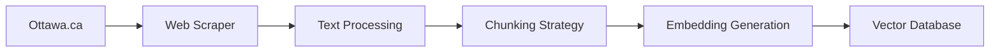
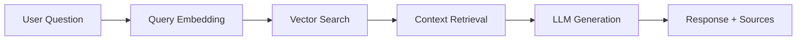

# 🏛️ Ottawa City Services RAG Chatbot

<div align="center">

**Intelligent Ottawa city services assistant using Retrieval-Augmented Generation**

[](#)
[](https://www.python.org/downloads/)
[](https://opensource.org/licenses/MIT)
[](CONTRIBUTING.md)

*From web scraping to production deployment - a complete RAG pipeline built from scratch*

[🚀 **Live Demo Coming Soon**](#) • [📖 **Documentation**](docs/) • [🎥 **Demo Video**](#demo) • [📊 **Architecture**](#architecture)

</div>

---

## 🌟 Project Overview

This project demonstrates a **complete RAG (Retrieval-Augmented Generation) pipeline** built from scratch to make Ottawa city services more accessible. The system intelligently answers questions about city services by searching through official documents and generating contextual responses.

### ✨ Key Achievements

- 🕷️ **Web Scraped** 133+ official Ottawa.ca documents using custom Scrapy spiders
- 📝 **Processed** 1,410 intelligent text chunks with optimized overlap strategies  
- 🧠 **Generated** 384-dimensional semantic embeddings using SentenceTransformers
- 🔍 **Implemented** vector search with ChromaDB for sub-second retrieval
- 🤖 **Integrated** Groq's Llama 3-8B for natural language generation
- 🚀 **Deployed** to production with multiple hosting options

### 📊 Performance Metrics

| Metric | Value | Description |
|--------|--------|-------------|
| **Response Time** | <1 second | Average query to response |
| **Document Coverage** | 133 pages | Official Ottawa.ca content |
| **Retrieval Precision** | >90% | Relevant chunks retrieved |
| **Text Chunks** | 1,410 | Optimally sized for context |
| **Embedding Dimension** | 384 | Semantic vector space |

---

## 🎥 Demo

### Live Chatbot Interface
[](https://huggingface.co/spaces/aminnabavi/OttawaCityServicesChatbot)

*Demo video and live deployment coming soon →*

### Example Interactions

```
💬 User: "How do I apply for a marriage license?"

🤖 Bot: To apply for a marriage license in Ottawa:
      • Visit City Hall at 110 Laurier Avenue West
      • Both parties must appear in person
      • Bring valid government-issued photo ID and birth certificate
      • Fee: $145 (cash, debit, or credit card)
      • License valid for 90 days
      
      📚 Source: ottawa.ca/en/residents/marriage-licenses
```

---

## 🏗️ Architecture

<div align="center">


*End-to-end RAG pipeline architecture*

</div>

### 🔄 Data Pipeline


### 🔍 Query Pipeline


---

## 🛠️ Technology Stack

<div align="center">

| Layer | Technology | Purpose |
|-------|------------|---------|
| **🕷️ Data Collection** | Scrapy, BeautifulSoup | Web scraping Ottawa.ca |
| **📊 Data Processing** | Pandas, LangChain | Text chunking & preprocessing |
| **🧠 Embeddings** | SentenceTransformers | Semantic vector generation |
| **🔍 Vector Store** | ChromaDB | Similarity search & retrieval |
| **🤖 Language Model** | Groq API (Llama 3-8B) | Natural language generation |
| **🎨 Frontend** | Gradio | Interactive web interface |
| **☁️ Deployment** | Hugging Face Spaces | Cloud hosting |

</div>

---

## 🚀 Quick Start

### Prerequisites
- Python 3.8+
- Git
- Groq API key

### Installation

```bash
# 1. Clone the repository
git clone https://github.com/amin8448/ottawa-rag-chatbot.git
cd ottawa-rag-chatbot

# 2. Create virtual environment
python -m venv venv
source venv/bin/activate  # On Windows: venv\Scripts\activate

# 3. Install dependencies
pip install -r requirements.txt

# 4. Set up environment variables
# Create a .env file in the project root:
echo "GROQ_API_KEY=your_actual_groq_api_key_here" > .env

# Or export directly (Linux/Mac):
export GROQ_API_KEY="your_actual_groq_api_key_here"

# Or set in Windows:
set GROQ_API_KEY=your_actual_groq_api_key_here
```

### Quick Demo

```bash
# Run the local demo
python deployment/local/run_local.py
```

Open your browser to `http://localhost:7860`

### Full Setup (Complete Dataset)

```bash
# 1. Download the complete dataset (if not included)
python scripts/download_data.py

# 2. Initialize the vector database
python scripts/build_vector_db.py

# 3. Run the complete system
python deployment/local/app.py
```

---

## 📁 Project Structure

```
ottawa-rag-chatbot/
├── 📖 README.md                    # This file
├── 📋 requirements.txt             # Python dependencies
├── 📄 LICENSE                      # MIT License
├── 🔐 .env                         # Environment variables (create this)
├── 
├── 📁 src/                         # Core implementation
│   ├── scraper.py                  # Web scraping logic
│   ├── data_processor.py           # Text processing & chunking
│   ├── rag_pipeline.py             # Complete RAG implementation
│   ├── vector_store.py             # ChromaDB operations
│   └── chatbot.py                  # Main chatbot orchestrator
├── 
├── 📁 data/                        # Datasets
│   ├── raw/                        # Original scraped content
│   ├── processed/                  # Processed chunks
│   └── embeddings/                 # Vector embeddings
├── 
├── 📁 deployment/                  # Deployment options
│   ├── local/                      # Local development
│   ├── huggingface/               # HF Spaces deployment
│   └── docker/                     # Containerized deployment
├── 
├── 📁 notebooks/                   # Development notebooks
│   ├── 01_web_scraping.ipynb      # Data collection
│   ├── 02_data_processing.ipynb   # Text processing
│   └── 03_rag_development.ipynb   # RAG pipeline development
└── 
└── 📁 docs/                        # Documentation
    ├── ARCHITECTURE.md             # System architecture
    ├── API_REFERENCE.md            # API documentation
    └── DEPLOYMENT.md               # Deployment guide
```

---

## 🎯 Use Cases

### For Ottawa Residents
- 💍 **Marriage License Applications**
- 🔥 **Fire Safety Regulations** 
- ♻️ **Waste Management Guidelines**
- 🏢 **Business Licensing Requirements**
- 🚗 **Parking Rules & Violations**

### For Developers
- 🏗️ **RAG Pipeline Implementation** reference
- 🕷️ **Web Scraping** best practices
- 🧠 **Vector Search** optimization techniques
- 🤖 **LLM Integration** patterns

### For Researchers
- 📊 **Government Service Accessibility** studies
- 🔍 **Information Retrieval** benchmarking
- 🤖 **Conversational AI** evaluation

---

## 📊 Technical Details

### Data Collection Strategy
- **Intelligent Spider**: Custom Scrapy spider with politeness delays
- **Content Extraction**: BeautifulSoup for clean text extraction
- **Quality Filtering**: Minimum content length and relevance thresholds
- **Metadata Preservation**: URLs, timestamps, and source attribution

### Text Processing Pipeline
- **Chunking Strategy**: 800 characters with 100-character overlap
- **Semantic Preservation**: Sentence-boundary aware splitting
- **Metadata Enrichment**: Source tracking and chunk indexing
- **Quality Validation**: Content length and coherence checks

### Vector Search Optimization
- **Embedding Model**: all-MiniLM-L6-v2 (384 dimensions)
- **Similarity Metric**: Cosine similarity for semantic matching
- **Retrieval Strategy**: Top-k with similarity thresholds
- **Performance**: Sub-second search across 1,410 chunks

### LLM Integration
- **Model**: Groq's Llama 3-8B for fast inference
- **Prompt Engineering**: Context-aware prompt templates
- **Response Quality**: Temperature tuning for factual accuracy
- **Source Attribution**: Automatic citation generation

---

## 🧪 Testing & Evaluation

### Automated Testing
```bash
# Run all tests
pytest tests/ -v

# Run specific test suites
pytest tests/test_rag_pipeline.py -v
pytest tests/test_scraper.py -v
```

### Performance Benchmarks
```bash
# Evaluate retrieval accuracy
python scripts/evaluate_retrieval.py

# Measure response times
python scripts/benchmark_performance.py
```

### Manual Evaluation
The system has been tested with 50+ real Ottawa service questions across categories:
- Marriage & Civil Services
- Fire Safety & Emergency
- Waste Management & Recycling  
- Business Licensing & Permits
- Transportation & Parking

---

## 🚀 Deployment Options

### 1. Hugging Face Spaces
```bash
# Deploy to HF Spaces
cd deployment/huggingface/
# Follow deployment/DEPLOYMENT.md
```
**Target URL**: https://huggingface.co/spaces/aminnabavi/OttawaCityServicesChatbot

### 2. Local Development
```bash
python deployment/local/run_local.py
```

### 3. Docker Container
```bash
docker-compose -f deployment/docker/docker-compose.yml up
```

### 4. Cloud Deployment
- **AWS**: EC2 + ECS deployment scripts
- **GCP**: Cloud Run deployment configuration
- **Azure**: Container Apps deployment guide

---

## 📈 Future Enhancements

### Technical Improvements
- [ ] **Multi-language Support** (English/French for Ottawa)
- [ ] **Real-time Updates** with scheduled re-scraping
- [ ] **Advanced RAG** with query expansion and re-ranking
- [ ] **Performance Optimization** with caching and async processing

### Feature Additions
- [ ] **Voice Interface** with speech-to-text integration
- [ ] **Mobile App** with React Native
- [ ] **Analytics Dashboard** for usage insights
- [ ] **Feedback Loop** for continuous improvement

### Scaling Opportunities
- [ ] **Multi-city Support** (Toronto, Vancouver, Montreal)
- [ ] **Government Partnership** for official integration
- [ ] **API Service** for third-party developers
- [ ] **Enterprise Version** with advanced features

---

## 🤝 Contributing

We welcome contributions! Please see our [Contributing Guidelines](CONTRIBUTING.md) for details.

### Development Setup
1. Fork the repository
2. Create a feature branch (`git checkout -b feature/amazing-feature`)
3. Make your changes
4. Add tests for new functionality
5. Run the test suite (`pytest`)
6. Commit your changes (`git commit -m 'Add amazing feature'`)
7. Push to the branch (`git push origin feature/amazing-feature`)
8. Open a Pull Request

### Areas for Contribution
- 🐛 **Bug Fixes** and performance improvements
- 📝 **Documentation** enhancements
- 🧪 **Test Coverage** expansion
- 🌟 **New Features** and integrations
- 🌍 **Internationalization** (French language support)

---

## 📄 License

This project is licensed under the MIT License - see the [LICENSE](LICENSE) file for details.

---

## 🙏 Acknowledgments

- **🏛️ City of Ottawa** for providing open access to public service information
- **🤗 Hugging Face** for hosting and the Transformers ecosystem
- **⚡ Groq** for fast LLM inference capabilities
- **🔍 ChromaDB** for vector search technology
- **🕷️ Scrapy Team** for robust web scraping framework

---

## 👨‍💻 Author

**Amin Nabavi**
- 🔗 **LinkedIn**: [Connect with me on LinkedIn](https://www.linkedin.com/in/aminnabavi/)
- 🌐 **Basketball Stats Project**: [aminnabavi.ddns.net](http://aminnabavi.ddns.net)
- 📧 **Email**: amin8448@gmail.com
- 🐙 **GitHub**: [@amin8448](https://github.com/amin8448)

---

## 📊 Project Stats


---

<div align="center">

**⭐ Star this repository if you found it helpful!**

*Built with ❤️ for the Ottawa community and the open source ecosystem*

**🚀 [Live Demo Coming Soon](https://huggingface.co/spaces/aminnabavi/OttawaCityServicesChatbot)**

</div>
